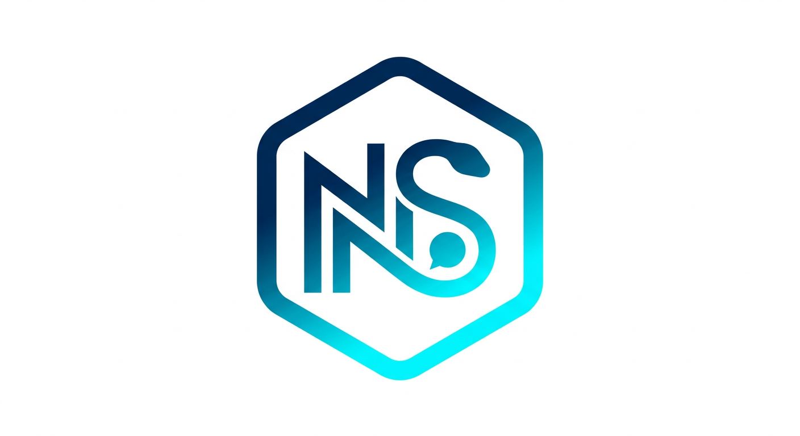

<div align="center">



<h1>NSplusthon</h1>

<p>
  <strong>Asynchronous Python library for the Soroush Plus API</strong>
</p>

<p dir="rtl">
  کتابخانه‌ای مدرن و سریع بر پایه <strong>asyncio</strong> برای تعامل مستقیم
  با API پیام‌رسان <strong>سروش پلاس</strong> — به‌عنوان <strong>کاربر</strong> یا <strong>ربات</strong>.
</p>

<p>

<a href="https://pypi.org/project/nsplusthon/">
  
</a>

<a href="https://pypi.org/project/nsplusthon/">
  
</a>

<a href="LICENSE">
  
</a>

<a href="https://github.com/Amogrotex/NSplusthon/stargazers">
  
</a>

<a href="https://github.com/Amogrotex/NSplusthon/issues">
  
</a>

</p>

<p>

<a href="https://Amogrotex.github.io/NSplusthon/"><strong>📖 Documentation</strong></a>
•
<a href="https://pypi.org/project/nsplusthon/"><strong>📦 PyPI</strong></a>
•
<a href="https://github.com/Amogrotex/NSplusthon"><strong>🐙 GitHub</strong></a>
•
<a href="https://web.splus.ir"><strong>💬 Soroush Plus</strong></a>

</p>

</div>

---

## ✨ ویژگی‌ها

- ✅ پشتیبانی کامل از **حساب کاربری** و **ربات**
- ⚡ مبتنی بر **asyncio** با کارایی بالا
- 🔄 استفاده همزمان به‌صورت **Sync** و **Async**
- 🧩 پشتیبانی کامل از **TL Schema** اختصاصی سروش (Layer 182)
- 💾 مدیریت انعطاف‌پذیر Session: `StringSession` / `MemorySession` / `SQLiteSession`
- 🌐 ترنسپورت **WebSocket** و **DC Routing**
- 🔒 رمزنگاری **RSA** و **AES**
- 🗝️ **بدون نیاز به API ID و API Hash**
- 🪜 API مشابه Telethon برای مهاجرت آسان
- 📝 پکیج **Typed** (`py.typed`) — تایپ‌چک کامل با Pyright / Pylance / mypy
- 🚀 مسیر OpenSSL بهینه برای AES-IGE (چند برابر سریع‌تر از کتابخانه‌های مشابه)

## 📊 عملکرد

بنچمارک AES-IGE روی مسیر **libssl** (بدون cryptg) — ۲۵۶ کیلوبایت،
Intel Xeon @ 2.60GHz، Python 3.13.14، بهترینِ ۹ اجرا.
خروجی با مرجع C بیت‌به‌بیت یکسان بود.

| کتابخانه   | زمان رمزگذاری | سرعت         |
| ---------- | :------: | :-----------: |
| **NSplusthon** | **2.50 ms** | **100.1 MiB/s** |
| SPlusthon  | 44.86 ms | 5.6 MiB/s     |
| spluspy    | 42.47 ms | 5.9 MiB/s     |

NSplusthon روی این مسیر حدود **۱۸ برابر** سریع‌تر است
(`from_buffer_copy` به‌جای کپی بایت‌به‌بایت در سطح Python).

اسکریپت بنچمارک: [`benchmarks/aes_ige_bench.py`](benchmarks/aes_ige_bench.py)

## 🚀 نصب

نیاز به **Python 3.9 یا بالاتر**.

از PyPI:

```bash
pip install nsplusthon
```

نصب کامل با بهینه‌سازی‌های سرعت (cryptg + پروکسی + پردازش رسانه):

```bash
pip install "nsplusthon[fast]"
```

آخرین نسخه توسعه از Git:

```bash
pip install git+https://github.com/Amogrotex/NSplusthon.git
```

### وابستگی‌های اختیاری (Extras)

| Extra    | محتوا                                        |
| -------- | -------------------------------------------- |
| `cryptg` | رمزنگاری C سریع‌تر (توصیه‌شده)                 |
| `socks`  | پشتیبانی از پروکسی SOCKS                      |
| `fast`   | همه‌چیز: `cryptg` + `socks` + `Pillow` + `hachoir` + `isal` |
| `dev`    | ابزارهای توسعه: `pytest` + `pytest-asyncio` + `pytest-cov` |

وابستگی‌های اصلی: `aiohttp`، `pyaes`، `rsa`

## ⚡ شروع سریع

```python
from nsplusthon import SoroushClient
from nsplusthon.sessions import StringSession

client = SoroushClient(StringSession())
client.start()
```

> ⚠️ **نکته:** فایل اسکریپت خود را `nsplusthon.py` **نامگذاری نکنید** —
> پایتون هنگام import با خود کتابخانه تداخل پیدا می‌کند.

## 💬 یک ربات ساده

```python
from nsplusthon import SoroushClient, events
from nsplusthon.sessions import StringSession

client = SoroushClient(StringSession())

@client.on(events.NewMessage)
async def handler(event):
    await event.reply("سلام 👋")

client.start()
client.run_until_disconnected()
```

### ارسال پیام

```python
client.send_message("username", "سلام از NSplusthon ❤️")
```

### ارسال فایل

```python
client.send_file("username", "/path/image.jpg")
```

### دانلود رسانه

```python
message = client.get_messages("username", limit=1)[0]
message.download_media()
```

## 🔄 حالت همگام (Sync)

اگر با `async/await` راحت نیستید، از API همگام استفاده کنید:

```python
from nsplusthon.sync import SoroushClient
from nsplusthon.sessions import StringSession

with SoroushClient(StringSession()) as client:
    print(client.get_me())
    client.send_message("username", "درود!")
```

## 🔐 Session ذخیره‌شده

Session را یک‌بار ذخیره کنید و در اجراهای بعدی از همان استفاده کنید:

```python
from nsplusthon import SoroushClient
from nsplusthon.sessions import StringSession

session = "1AwA..."  # رشته‌ای که پس از ورود اولیه ذخیره می‌کنید

with SoroushClient(StringSession(session)) as client:
    print(client.get_me())
```

## 📚 مستندات

مستندات کامل پروژه (فارسی):

👉 [https://Amogrotex.github.io/NSplusthon/](https://Amogrotex.github.io/NSplusthon/)

- [شروع سریع](https://Amogrotex.github.io/NSplusthon/quick-start/)
- [مفاهیم پایه](https://Amogrotex.github.io/NSplusthon/concepts/index/)
- [مثال‌ها](https://Amogrotex.github.io/NSplusthon/examples/index/)
- [سوالات متداول](https://Amogrotex.github.io/NSplusthon/faq/)

## 🤝 مشارکت

Pull requestها خوشحال‌کننده‌اند! لطفاً:

1. یک Issue برای مشکل یا ویژگی جدید باز کنید
2. روی شاخه‌ای جدا کار کنید
3. قبل از ارسال، مطمئن شوید کد byte-compile می‌شود: `python -m compileall nsplusthon`
4. توضیح تغییرات را در PR بنویسید

## ⚖️ مجوز

این پروژه تحت مجوز [GNU GPL v3](LICENSE) منتشر شده است.

> ⚠️ **توجه:** این کتابخانه شخص ثالث است و وابستگی به سروش پلاس ندارد.
> هنگام استفاده، [قوانین و شرایط استفاده سروش پلاس](https://web.splus.ir) را رعایت کنید.
> مسئولیت نحوه استفاده از این پروژه بر عهده کاربر است.

---

<div align="center">

**NSplusthon** is maintained by [AmoGrotex](https://github.com/AmoGrotex)

</div>
